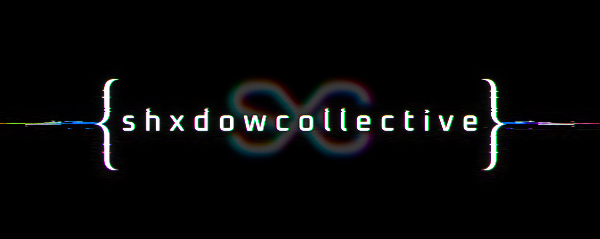
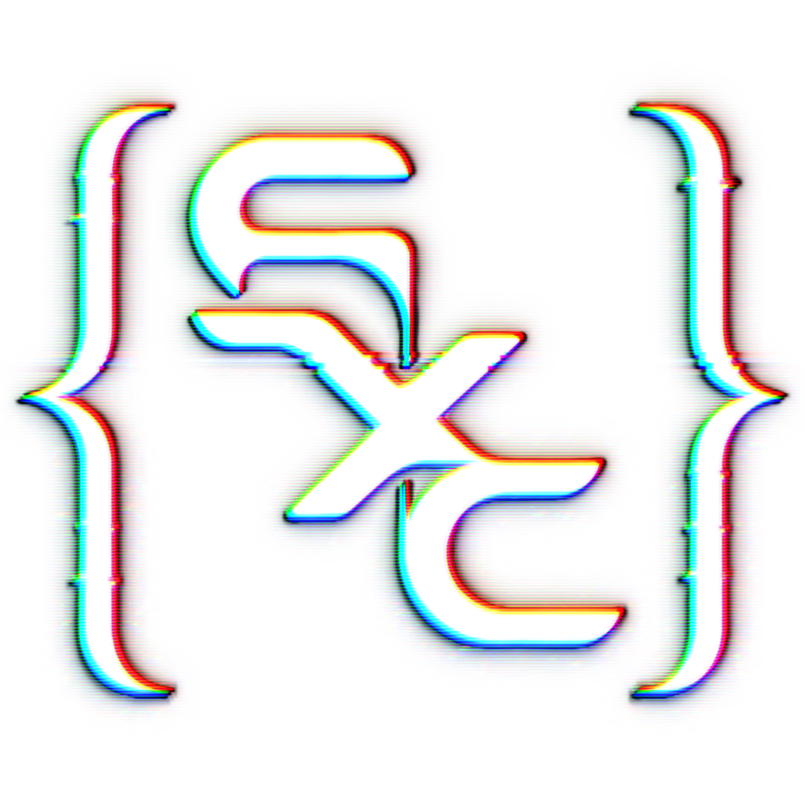

  <picture>
    <source media="(prefers-color-scheme: dark)" srcset="../assets/brand/shxdowcollective-banner-neutral.png">
    
  </picture>

  
  

# SHXDOWCOLLECTIVE

ShxdowCollective is a home for artists, outcasts, builders, and other ethereal entities, united through an unapologetic embrace of creativity, self-expression, and human agency.

Guided by Phxntom, also known as [shxdow.enby](https://github.com/shxdowenby), the Collective lives wherever art, technology, music, and storytelling combine.

<strong>

 w e _ a r e _ t h e _ s h x d o w s _  t h a t _ h a u n t _ t h e _ d y s t o p i a

</strong>

## Comms

| Signal | Where |
| --- | --- |
| Discord | [shxdow.cc](https://shxdow.cc) |
| Voidware | [github.com/ShxdowCollective/voidware](https://github.com/ShxdowCollective/voidware) |
| GitHub | [github.com/ShxdowCollective](https://github.com/ShxdowCollective) |

----

  

  <strong><code>d o _ n o _ h a r m / t a k e _ n o _ s h i t</code></strong>

  

